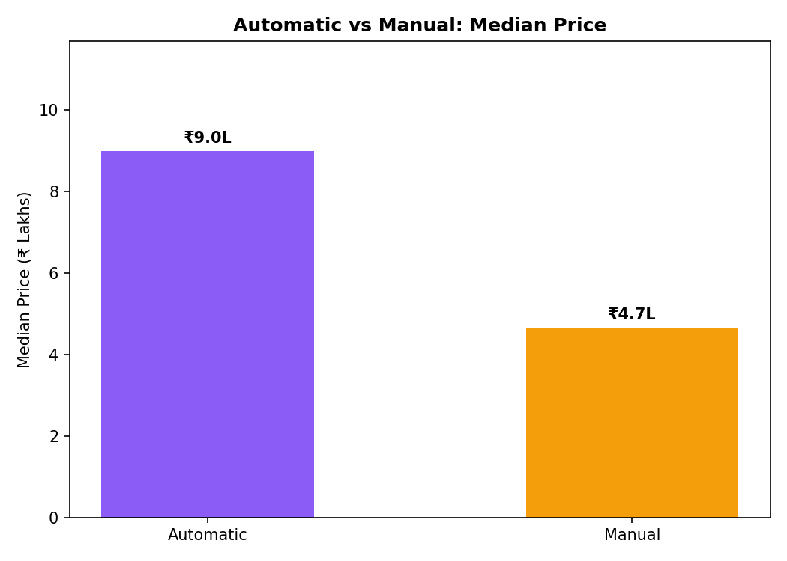
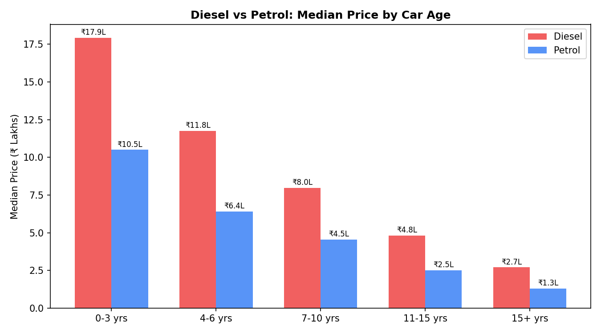
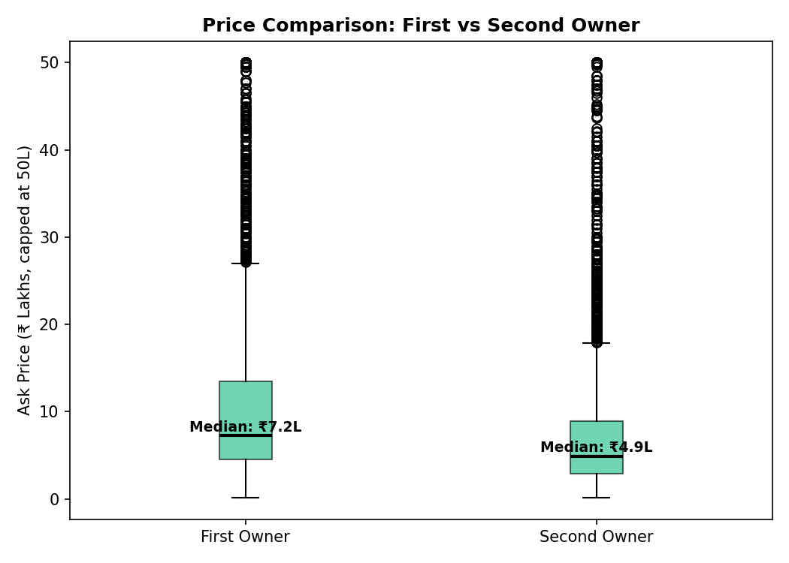
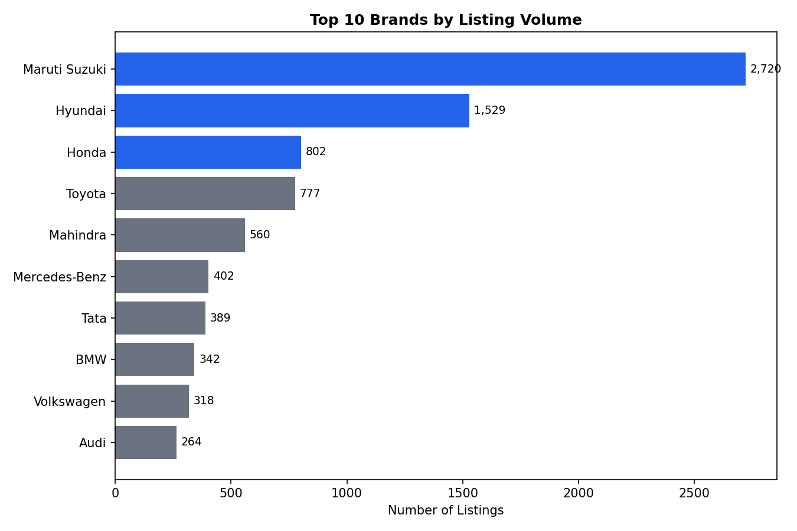
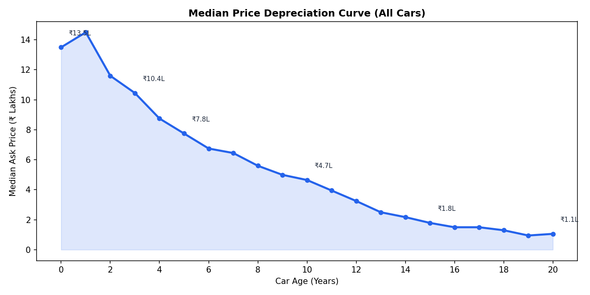
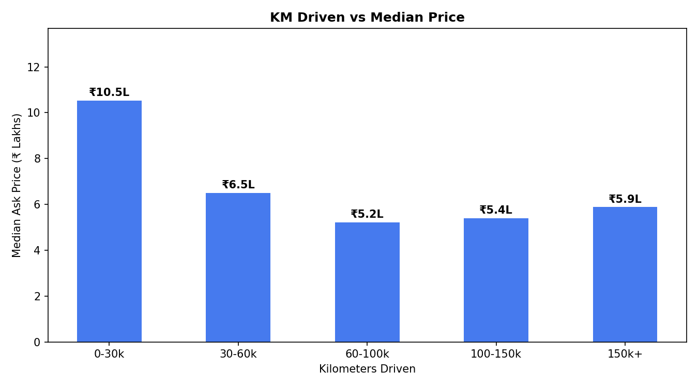
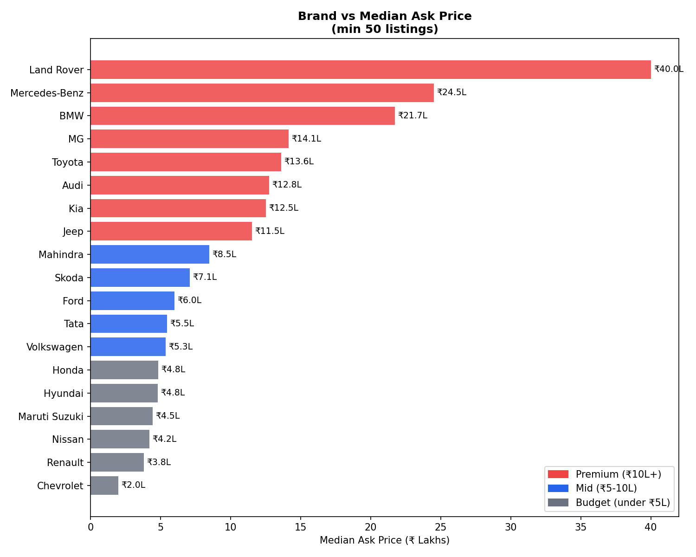

# Used Car Market Analysis — India 🚗
**Role:** Business Analyst Portfolio Project  
**Dataset:** 9,582 listings | 11 columns | Kaggle  
**Tools:** Python, Pandas, Matplotlib, NumPy

---

## Problem Statement
What factors drive used car pricing in India, and what can platforms like Spinny do better based on data?

## Key Business Insights

### 1. Automatic commands 93% price premium
Automatic cars median ₹9L vs manual ₹4.7L — yet both have equal listing volume (~4,800 each).  
**→ Transmission should be a first-level filter on platforms like Spinny, not buried under "more filters"**

### 2. First owner = ₹2.3L premium
Buyers consistently pay more for first owner cars across all segments.  
**→ A "Family Transfer" or "Single Owner" badge on second owner cars could reduce buyer hesitation**

### 3. Diesel carries hidden risk after 7 years
Diesel starts higher but the gap with petrol narrows sharply after 7 years — DPF issues and odd-even restrictions make older diesel a hidden risk.  
**→ Platforms should flag diesel cars older than 7 years with a risk warning**

### 4. Top 3 brands = 53% of all listings
Maruti Suzuki (28%), Hyundai, Honda dominate the market.  
**→ Platform UX and staff training should be optimised around these 3 brands first**

### 5. Steepest depreciation in first 4 years
A car loses ~40% of its value by age 4. After age 10 the curve flattens significantly.  
**→ Best value for buyers: 4-6 year old cars. Best time to sell: before 3 years**

### 6. Biggest km-driven price drop at 30k km
Price drops ₹4L just by crossing 30k km (₹10.5L → ₹6.5L). Plateaus after 60k.  
**→ Sellers should list before 30k km. Buyers get best value in 60-100k range**

### 7. MG and Kia hold premium value despite being newer brands
Both sit alongside BMW and Audi in resale pricing.  
**→ Brand trust is building fast for newer entrants**

### 8. Chevrolet collapsed to ₹2L after exiting India
Lowest resale value of all brands — service network absence kills resale.  
**→ Platforms should flag discontinued brands as higher risk for buyers**

---

## Charts

### Transmission vs Price


### Diesel vs Petrol Depreciation by Age


### First vs Second Owner Price


### Top 10 Brands by Volume


### Overall Depreciation Curve


### KM Driven vs Price


### Brand vs Median Price


---

## Product Recommendations for Spinny

## Product Recommendations for Spinny

| # | Insight from Data | Recommendation | Expected Impact | Effort |
|---|---|---|---|---|
| 1 | Automatic cars are 93% pricier yet equal in volume | Make transmission a **top-level filter** in search, not under "more filters" | Higher search-to-detail conversion | Low |
| 2 | First owner commands ₹2.3L premium | Add **ownership story badges** — "Single Owner", "Family Transfer" instead of just "2nd owner" | Reduces buyer hesitation, helps sellers justify price | Low |
| 3 | Diesel gap narrows sharply after 7 years | Show a **risk flag** on diesel cars older than 7 years — mention DPF costs, odd-even restrictions | Fewer post-purchase complaints, builds platform trust | Medium |
| 4 | Top 3 brands = 53% of listings | **Optimise hub staff training and app UX** around Maruti, Hyundai, Honda buyer journeys first | Better core experience for majority of users | Medium |
| 5 | Steepest depreciation in first 4 years | Show a **"Value Zone" indicator** on 4-6 year old cars — "Best time to buy" nudge | Faster buyer decisions, reduces drop-off | Low |
| 6 | ₹4L price drop after crossing 30k km | Add **"Low Mileage" badge** for cars under 30k km to justify premium pricing | Helps sellers, sets buyer expectations | Low |
| 7 | Chevrolet and other exited brands at bottom | **Flag discontinued brands** with "Limited service network" warning on listing page | Informed buying, reduces returns and complaints | Low |
| 8 | Registration city mismatch (personal observation) | Add **"Registered in: [City]"** filter so buyers see locally registered cars first | Reduces RC transfer friction, increases purchase confidence | Medium |

---

## How to Run

```bash
# Clone the repo
git clone https://github.com/harsh112003/used-car-analysis
cd used_car_analysis

# Setup virtual environment
python3 -m venv venv
source venv/bin/activate
pip install pandas numpy matplotlib

# Run the analysis
python data_analysis.py
```
```

---

*Project by HARSH KUMAR 2022UBT1056 | Targeting Product Analyst / Business Analyst roles*